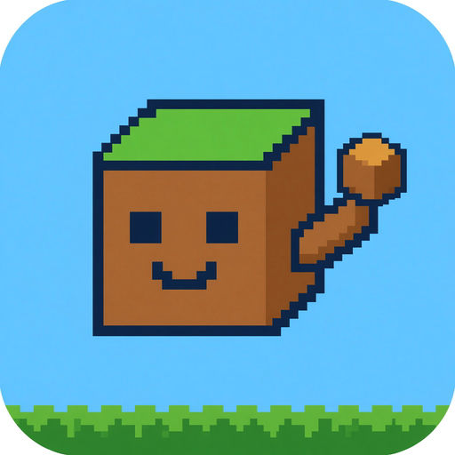
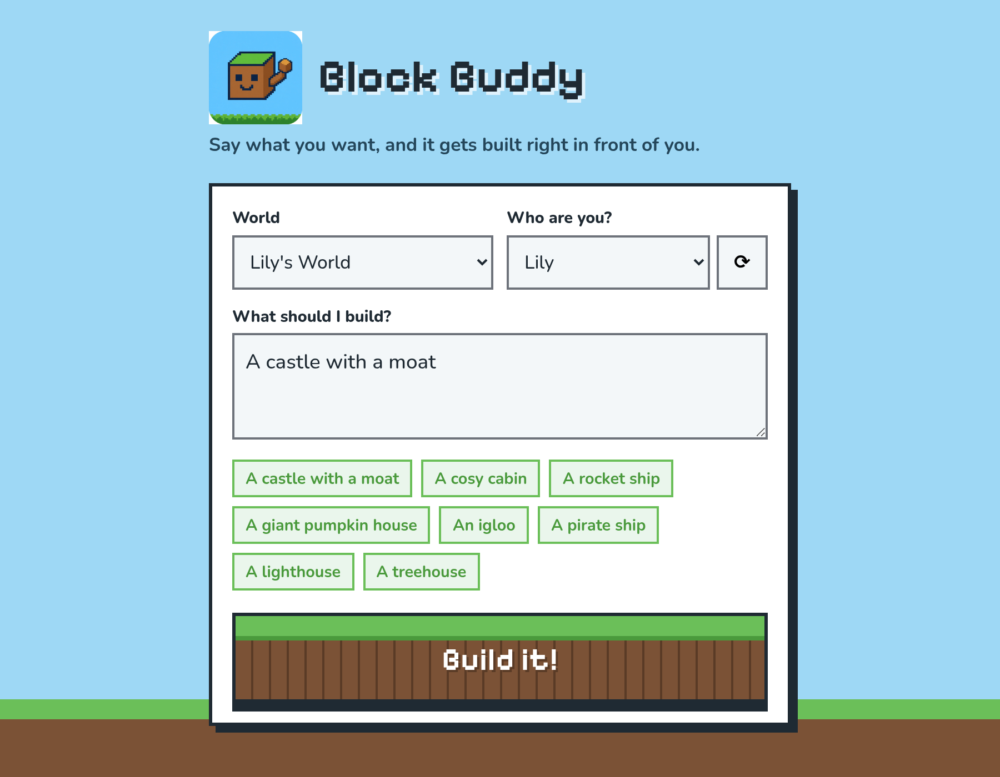
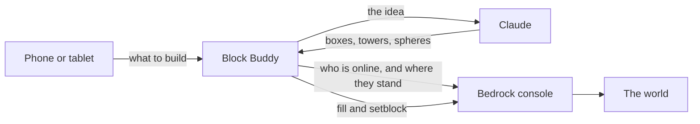

<p align="center">
  
</p>

<h1 align="center">Block Buddy</h1>

<p align="center">
  Say what you want. It gets built in your Minecraft Bedrock world.
</p>

<p align="center">
  <a href="https://github.com/TRU5T/block-buddy/pkgs/container/block-buddy"></a>
  <a href="block-buddy.xml"></a>
  <a href="https://github.com/TRU5T/block-buddy/issues"></a>
</p>

<p align="center">
  
</p>

A kid types "build me a castle with a moat" on a phone or tablet. Claude designs it, and Block Buddy places it in front of them with vanilla `/fill` and `/setblock` commands. There are no mods or addons, and cheats can stay off.

It talks to your [itzg/minecraft-bedrock-server](https://github.com/itzg/docker-minecraft-bedrock-server) containers through the Docker socket, so the Minecraft servers can sit on their own IPs and Block Buddy still reaches the console.

## Install on Unraid

The container image is `ghcr.io/tru5t/block-buddy:latest`. Unraid is x86_64, which is the architecture the image is built for.

The template is [`block-buddy.xml`](block-buddy.xml). It publishes the page on host port **8090**, mounts the Docker socket, and asks for your API key and server list.

### 1. Make the image public

GitHub publishes the image on every push to `main`. A new package starts out private, and Unraid cannot pull a private image.

After the first successful [Publish image](https://github.com/TRU5T/block-buddy/actions/workflows/docker.yml) run:

1. Open the [block-buddy package](https://github.com/TRU5T/block-buddy/pkgs/container/block-buddy).
2. Package settings → Change visibility → Public.

### 2. Add the template

On Unraid, go to **Settings → Docker** and add this to **Template repositories**:

```text
https://github.com/TRU5T/block-buddy
```

Then **Docker → Add Container**, and pick **block-buddy** in the template dropdown.

Or, from the Unraid terminal, drop it straight into user templates:

```bash
mkdir -p /boot/config/plugins/dockerMan/templates-user
wget -O /boot/config/plugins/dockerMan/templates-user/my-block-buddy.xml \
  https://raw.githubusercontent.com/TRU5T/block-buddy/main/block-buddy.xml
```

**Docker → Add Container**, then choose **block-buddy** under **User templates**.

### 3. Fill in the container

| Field | Example | What it does |
| --- | --- | --- |
| Web UI | `8090` | The page, at `http://YOUR-UNRAID-IP:8090` |
| Docker Socket | `/var/run/docker.sock` | How Block Buddy reaches the Bedrock consoles. Leave this mounted. |
| Anthropic API Key | `sk-ant-...` | From [console.anthropic.com](https://console.anthropic.com). A build costs a few cents on Sonnet. |
| Servers | `Lily's World=mc-lily,Jack's World=mc-jack` | Display name, then `=`, then the container name. Names must match exactly. |
| PIN | `1234` | Optional. The page asks once and remembers it on that device. |
| Model | `claude-sonnet-5-5` | Advanced. An Opus model makes fancier builds, more slowly, and costs more. |

Apply. Open the WebUI on a phone or tablet that is on the same LAN.

### 4. Give each Bedrock container a console

Block Buddy writes commands to the server's own console. The itzg container only has one when it was created with an interactive terminal.

On each Bedrock container, set **Extra Parameters** to include `-it`, then Apply so Unraid recreates it. Without that, builds fail with "the server has no console input".

Cheats can stay off. Block Buddy does not use the image's `send-command` helper, which fails when the server is not running as root. On Unraid that is usually UID 99, GID 100.

## What a build does



1. The page asks the server `list` to find who is online.
2. On Build, it runs `querytarget` for that player's position and which way they face.
3. Claude returns a plan made of simple shapes: box, cylinder, sphere, pyramid, clear, and single blocks.
4. The plan is rotated to face the player, placed 3 blocks in front of them, and split so each `/fill` stays under Bedrock's 32,768-block limit.
5. Before anything is placed, the area is saved with `structure save`, so Undo can put it back.

## Good to know

- Keep Block Buddy on your LAN. Do not port-forward it. The Docker socket gives this container control of Docker on the host.
- The Bedrock containers can use their own IPs on `br0`. Block Buddy talks to them through Docker, not the network.
- The server runs about 20 commands a second, so a large build can take up to a couple of minutes to finish appearing. A new build in the same world waits until the last one is done.
- If one block type never appears, Bedrock is using a different ID. The names live in [`app/prompt.md`](app/prompt.md). A bad ID skips that command, and the rest of the build still runs.
- Undo restores only the most recent build in that world, and only until the app restarts.
- The build is placed in front of the player, so the chunks are loaded.
- Builds stay friendly. A request that is unkind, gory, or huge becomes a smaller kind version instead.

## Compose

```bash
cp .env.example .env
# edit .env, then:
docker compose up -d --build
```

[`docker-compose.yml`](docker-compose.yml) builds from this repo and publishes port 8090. The same file works with Unraid's Compose plugin.

## Build it on the Unraid box

If you would rather not pull from the registry:

```bash
cd /mnt/user/appdata/block-buddy
docker build -t block-buddy .

docker run -d --name block-buddy --restart unless-stopped \
  -p 8090:8080 \
  -v /var/run/docker.sock:/var/run/docker.sock \
  -e ANTHROPIC_API_KEY=sk-ant-... \
  -e SERVERS="Lily's World=mc-lily,Jack's World=mc-jack" \
  -e PIN=1234 \
  block-buddy
```

After you change the code, rebuild the image and recreate the container.

## Community Apps

This repo is laid out for an Unraid Community Apps submission: [`block-buddy.xml`](block-buddy.xml) is the template, [`ca_profile.xml`](ca_profile.xml) is the maintainer profile, and [`icon.png`](icon.png) is the icon. Submit it from [ca.unraid.net/submit](https://ca.unraid.net/submit) once the image is public.
